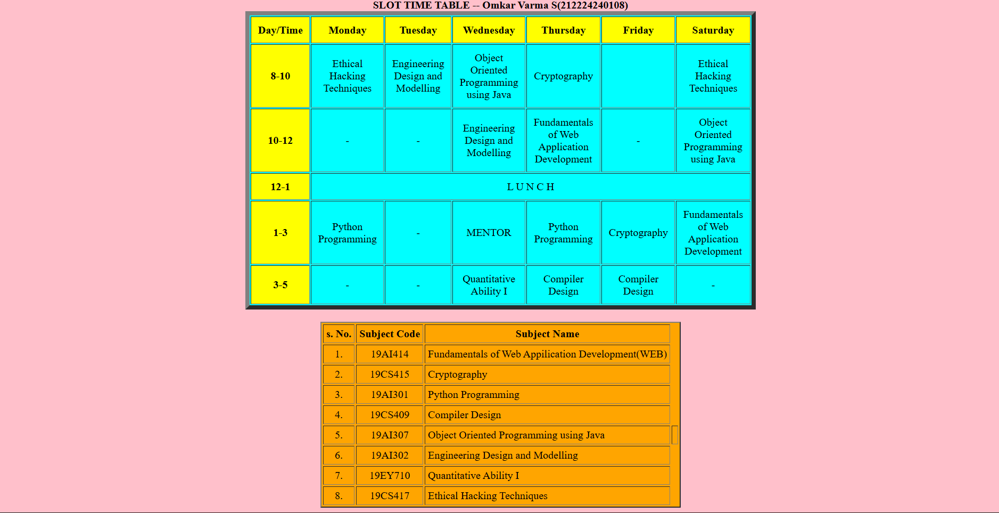

# Ex03 Time Table
## Date:16-10-2025

## AIM
To write a html webpage page to display your slot timetable.

## ALGORITHM
### STEP 1
Create a Django-admin Interface.

### STEP 2
Create a static folder and inert HTML code.

### STEP 3
Create a simple table using ```<table>``` tag in html.

### STEP 4
Add header row using ```<th>``` tag.

### STEP 5
Add your timetable using ```<td>``` tag.

### STEP 6
Execute the program using runserver command.

## PROGRAM

<html>
<head>
<title>slot Timetable</title>    
</head>
<body bgcolor="pink">
<body>
<center>

</center>
<br>
<table align="center" width="540" cellspacing="2" cellpadding="10" border="7" bgcolor="aqua">
<caption><b>SLOT TIME TABLE -- Omkar Varma S(212224240108)</b></caption>
<tr align="center">
<th bgcolor="yellow">Day/Time</th>
<th bgcolor="yellow">Monday</th>
<th bgcolor="yellow">Tuesday</th>
<th bgcolor="yellow">Wednesday</th>
<th bgcolor="yellow">Thursday</th>
<th bgcolor="yellow">Friday</th>
<th bgcolor="yellow">Saturday</th>
</tr>
<tr align="center">
<th bgcolor="yellow">8-10</th>
<td>Ethical Hacking Techniques</td>
<td>Engineering Design and Modelling</td>
<td>Object Oriented Programming using Java</td>
<td>Cryptography</td>
<td></td>
<td>Ethical Hacking Techniques</td>

</tr>
<tr align="center">
<th bgcolor="yellow">10-12</th>
<td>-</td>
<td>-</td>
<td>Engineering Design and Modelling</td>
<td>Fundamentals of Web Application Development</td>
<td>-</td>
<td>Object Oriented Programming using Java</td>
</tr>
<tr>
<th bgcolor="yellow">12-1</th>
<td colspan="6" align="center">L U N C H</td>
</tr>
<tr align="center">
<th bgcolor="yellow">1-3</th>
<td>Python Programming</td>
<td>-</td>
<td>MENTOR</td>
<td>Python Programming</td>
<td>Cryptography</td>
<td>Fundamentals of Web Application Development</td>
</tr>
<tr align="center">
<th bgcolor="yellow">3-5</th>
<td>-</td>
<td>-</td>
<td>Quantitative Ability I</td>
<td>Compiler Design</td>
<td>Compiler Design</td>
<td>-</td>
</tr>
</table>
<br>
<table align="center" cellspacing="3" cellpadding="4" border="2" bgcolor="orange">
<tr align="center">
<th>s. No.</th>
<th>Subject Code</th>
<th>Subject Name</th>
</tr>
<tr>
<td align="center">1.</td>
<td align="center">19AI414</td>
<td>Fundamentals of Web Appilication Development(WEB)</td>
</tr>
<tr>
<td align="center">2.</td>
<td align="center">19CS415</td>
<td>Cryptography</td>
</tr>
<tr>
<td align="center">3.</td>
<td align="center">19AI301</td>
<td>Python Programming</td>
</tr>
<tr>
<td align="center">4.</td>
<td align="center">19CS409</td>
<td>Compiler Design</td>
</tr>
<tr>
<td align="center">5.</td>
<td align="center">19AI307</td>
<td>Object Oriented Programming using Java<td>
</tr>
<tr>
<td align="center">6. </td>
<td align="center">19AI302</td>
<td>Engineering Design and Modelling</td>
<tr>
<td align="center">7. </td>
<td align="center">19EY710</td>
<td>Quantitative Ability I</td>
<tr>
<td align="center">8. </td>
<td align="center">19CS417</td>
<td>Ethical Hacking Techniques</td>
</tr>
</tr>
</tr>
</table>
</body>
</html>
## OUTPUT



## RESULT
The program for creating slot timetable using basic HTML tags is executed successfully.
